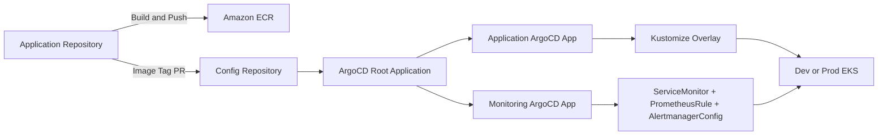
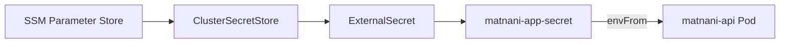

# Matnani Kubernetes Config

동네 기반 못난이 식품 거래 서비스 **맛난이(Matnani)** 의 Kubernetes 매니페스트와 ArgoCD GitOps 설정 저장소입니다.

공통 리소스는 Kustomize `base`에서 관리하고 Dev/Prod 차이는 `overlays`에서 패치합니다. ArgoCD는 환경별 App of Apps 구조로 애플리케이션과 모니터링 리소스를 지속적으로 동기화합니다.

## GitOps Flow



## Design Principles

- 공통 Kubernetes 리소스는 `base`, 환경별 차이는 `overlays/dev`, `overlays/prod`에서 관리합니다.
- Dev와 Prod는 서로 다른 EKS 클러스터와 namespace에 배포합니다.
- ArgoCD의 `prune`과 `selfHeal`로 Git 상태를 클러스터의 기준 상태로 유지합니다.
- 애플리케이션 image tag는 각 환경 overlay에서만 변경합니다.
- 비밀값은 저장소에 기록하지 않고 SSM Parameter Store와 External Secrets Operator로 주입합니다.
- Terraform과 ArgoCD가 같은 Kubernetes 리소스를 동시에 관리하지 않도록 소유권을 분리합니다.
- HPA/KEDA가 조정하는 Deployment replicas는 ArgoCD가 되돌리지 않도록 차이를 무시합니다.

## Tech Stack

| 영역 | 기술 |
| --- | --- |
| Container Orchestration | Amazon EKS, Kubernetes |
| GitOps | ArgoCD, App of Apps |
| Manifest Management | Kustomize Base/Overlay |
| Traffic | AWS Load Balancer Controller, ALB Ingress |
| Secret Delivery | External Secrets Operator, AWS SSM Parameter Store |
| Autoscaling | KEDA, HPA, Cluster Autoscaler |
| Monitoring | Prometheus Operator, ServiceMonitor, PrometheusRule, AlertmanagerConfig |

## Repository Structure

```text
team3-matnani-config/
├── apps/team3-matnani/
│   ├── base/
│   │   ├── deployment.yaml          # API Deployment, probes, resources
│   │   ├── service.yaml             # ClusterIP Service
│   │   ├── ingress.yaml             # 공통 ALB Ingress
│   │   ├── serviceaccount.yaml      # 애플리케이션 ServiceAccount
│   │   ├── keda-scaledobject.yaml   # CPU 기반 Pod autoscaling
│   │   └── kustomization.yaml
│   └── overlays/
│       ├── dev/                     # Dev image, namespace, env, SSM 경로
│       └── prod/                    # Prod image, namespace, env, SSM 경로
├── argocd/
│   ├── dev/
│   │   ├── root-app.yaml
│   │   ├── project.yaml
│   │   ├── application-dev.yaml
│   │   ├── application-monitoring.yaml
│   │   └── argocd-ingress.yaml
│   └── prod/
│       ├── root-app.yaml
│       ├── project.yaml
│       ├── application-prod.yaml
│       ├── application-monitoring.yaml
│       └── argocd-ingress.yaml
├── monitoring/
│   ├── base/                        # 공통 수집, 알람, Slack 리소스
│   └── overlays/
│       ├── dev/                     # Dev namespace와 Slack 설정
│       └── prod/                    # Prod namespace와 Slack 설정
└── README.md
```

## Environment

| 항목 | Dev | Prod |
| --- | --- | --- |
| Namespace | `team3-matnani-dev` | `team3-matnani-prod` |
| Spring Profile | `dev` | `prod` |
| ECR Repository | `team3-matnani-dev-api` | `team3-matnani-prod-api` |
| Initial Replicas | Base 1 | Overlay 2, 이후 KEDA/HPA 관리 |
| Pod Resources | 250m/512Mi 요청 | 500m/1Gi 요청 |
| ALB | `team3-matnani-dev-alb` | `team3-matnani-prod-alb` |
| Secret Path | `/team3/matnani/dev/*` | `/team3/matnani/prod/*` |
| Monitoring Target | Dev API namespace | Prod API namespace |
| Slack Channel | Dev alerts | Prod alerts |

실제 image tag와 endpoint 값의 최종 기준은 각 환경의 `kustomization.yaml`과 patch 파일입니다.

## Application Manifests

### Deployment

- Spring Boot API는 `8080` 포트를 사용합니다.
- readiness probe는 `/actuator/health`로 트래픽 수신 가능 여부를 판단합니다.
- liveness probe는 같은 endpoint로 애플리케이션 복구 필요 여부를 판단합니다.
- `topologySpreadConstraints`와 `kubernetes.io/hostname`을 이용해 Pod를 노드별로 분산합니다.
- `ScheduleAnyway`를 사용해 분산 조건을 만족하지 못해도 Pod 배포 자체는 막지 않습니다.

### Autoscaling

KEDA ScaledObject가 API Deployment를 대상으로 CPU 사용률을 감시합니다.

```text
Target CPU: 70%
Min replicas: 1
Max replicas: 5
Cooldown: 300s
```

Prod ArgoCD Application은 Deployment의 `/spec/replicas`를 `ignoreDifferences`로 제외하고 `RespectIgnoreDifferences=true`를 사용합니다. 따라서 ArgoCD self-heal과 KEDA/HPA가 replicas 값을 두고 충돌하지 않습니다.

### Ingress

- AWS Load Balancer Controller가 Ingress를 감지해 internet-facing ALB를 관리합니다.
- Target type은 `ip`이며 Pod로 직접 라우팅합니다.
- `/actuator/health`를 ALB health check endpoint로 사용합니다.
- Dev/Prod overlay가 환경별 ALB 이름을 지정합니다.

## Secret Flow



`ClusterSecretStore`와 ESO Helm release는 Infra 저장소가 관리합니다. 이 저장소는 환경별 `ExternalSecret`과 Kubernetes Secret 매핑만 관리합니다.

애플리케이션이 사용하는 주요 Secret key는 다음과 같습니다.

```text
SPRING_DATASOURCE_URL
SPRING_DATASOURCE_USERNAME
SPRING_DATASOURCE_PASSWORD
JWT_SECRET
SPRING_DATA_REDIS_HOST
BUSINESS_API_KEY
CLOUD_AWS_S3_BUCKET
```

SSM parameter의 값은 Git이나 ArgoCD 화면에 기록하지 않습니다.

## ArgoCD App Of Apps

Dev와 Prod는 각각 자신의 EKS 클러스터에서 별도 root application을 실행합니다.

```text
team3-matnani-root-{env}
├── team3-matnani-project
├── team3-matnani-app-{env}
├── team3-matnani-monitoring
└── argocd-ingress
```

클러스터 최초 구성 시 root application만 한 번 수동 적용합니다.

```powershell
# Dev
kubectl --context matnani-dev apply -f argocd/dev/root-app.yaml

# Prod
kubectl --context matnani-prod apply -f argocd/prod/root-app.yaml
```

이후 `main` 변경은 ArgoCD가 자동 감지하며, 삭제된 리소스는 `prune`, 수동 변경은 `selfHeal`로 Git 상태에 맞춥니다.

## Image Update Workflow

백엔드 CI가 새 image를 ECR에 push한 뒤 환경 overlay의 `newTag`를 변경합니다.

```yaml
images:
  - name: team3-matnani-api
    newName: <environment-ecr-repository>
    newTag: "<git-sha>"
```

1. App Repository에서 Docker image를 빌드하고 ECR에 push합니다.
2. Config Repository의 환경별 `newTag` 변경 PR을 생성합니다.
3. PR을 검토하고 병합합니다.
4. ArgoCD가 변경을 감지해 Deployment rollout을 수행합니다.
5. Pod readiness와 image tag를 확인합니다.

Prod image 변경은 반드시 PR diff와 배포 대상 SHA를 검토한 후 병합합니다.

## Monitoring Ownership

| 소유자 | 관리 대상 |
| --- | --- |
| Infra Repository / Terraform | kube-prometheus-stack, ESO, Namespace, ClusterSecretStore, IRSA |
| Config Repository / ArgoCD | ExternalSecret, AlertmanagerConfig, ServiceMonitor, PrometheusRule |

동일한 `ExternalSecret` 또는 `AlertmanagerConfig`를 Terraform과 Config Repository 양쪽에 만들면 Slack 중복 알림과 ArgoCD drift가 발생합니다. 리소스를 이동할 때는 기존 Terraform state와 클러스터의 레거시 리소스까지 정리합니다.

### Application Metrics

ServiceMonitor는 환경별 API namespace의 `app=matnani-api` Service를 선택하고, 15초마다 `/actuator/prometheus`를 수집합니다.

### Alert Rules

| Alert | 조건 | 대기 시간 |
| --- | --- | --- |
| `HighErrorRate` | 5xx 요청 비율 1% 초과 | 1분 |
| `HighLatency` | p99 응답시간 500ms 초과 | 2분 |
| `PodDown` | API scrape target down | 1분 |
| `HighMemoryUsage` | 컨테이너 메모리 85% 초과 | 5분 |

Alertmanager는 환경별 SSM Slack Webhook과 채널을 사용하며 firing/resolved 알림을 전송합니다.

## Local Validation

PR 전에 Dev/Prod rendering 결과를 모두 확인합니다.

```powershell
kubectl kustomize apps/team3-matnani/overlays/dev
kubectl kustomize apps/team3-matnani/overlays/prod
kubectl kustomize monitoring/overlays/dev
kubectl kustomize monitoring/overlays/prod
```

클러스터 CRD가 준비된 환경에서는 server-side dry run으로 API 호환성도 확인합니다.

```powershell
kubectl --context matnani-dev apply --dry-run=server -k apps/team3-matnani/overlays/dev
kubectl --context matnani-dev apply --dry-run=server -k monitoring/overlays/dev

kubectl --context matnani-prod apply --dry-run=server -k apps/team3-matnani/overlays/prod
kubectl --context matnani-prod apply --dry-run=server -k monitoring/overlays/prod
```

## Deployment Verification

### ArgoCD

```powershell
kubectl --context matnani-dev get applications -n argocd
kubectl --context matnani-prod get applications -n argocd
```

모든 Application이 `Synced`와 `Healthy`인지 확인합니다.

### Application

```powershell
kubectl --context matnani-prod get deploy,pod,svc,ingress -n team3-matnani-prod
kubectl --context matnani-prod rollout status deploy/matnani-api -n team3-matnani-prod
kubectl --context matnani-prod get pods -n team3-matnani-prod -o custom-columns="NAME:.metadata.name,IMAGE:.spec.containers[0].image,READY:.status.containerStatuses[0].ready"
```

### Secrets

```powershell
kubectl --context matnani-prod get clustersecretstore aws-parameter-store
kubectl --context matnani-prod get externalsecret -A
kubectl --context matnani-prod get externalsecret matnani-app-secret -n team3-matnani-prod
```

Secret의 실제 값은 출력하지 않고 `READY=True`와 동기화 상태만 확인합니다.

### Monitoring

```powershell
kubectl --context matnani-prod get servicemonitor,prometheusrule,alertmanagerconfig -n monitoring
kubectl --context matnani-prod get externalsecret slack-webhook -n monitoring
kubectl --context matnani-prod get pods -n monitoring
```

## Rollback

가장 최근의 정상 image SHA로 overlay의 `newTag`를 되돌리는 PR을 생성합니다. ArgoCD가 병합된 변경을 sync하면 Kubernetes가 이전 image로 rollout합니다.

긴급 상황에서도 클러스터에서 Deployment image를 직접 수정한 상태로 끝내지 않습니다. 임시 조치 후 반드시 Config Repository에 동일 변경을 반영하거나 Git 기준 상태로 복구합니다.

## Troubleshooting

### Application Is OutOfSync

1. ArgoCD Application의 diff를 확인합니다.
2. KEDA/HPA가 관리하는 `/spec/replicas` 차이인지 확인합니다.
3. Git에 없는 수동 리소스인지 확인합니다.
4. 의도한 변경이면 Config Repository를 수정하고, 아니면 ArgoCD sync/self-heal로 복구합니다.

### ExternalSecret Is Not Ready

1. `ClusterSecretStore`의 `READY` 상태를 확인합니다.
2. ExternalSecret의 SSM 경로가 현재 환경과 일치하는지 확인합니다.
3. ESO ServiceAccount의 IRSA Role과 SSM 권한 범위를 확인합니다.
4. `describe externalsecret`의 event를 확인하되 Secret 값은 출력하지 않습니다.

### Alert Is Sent Twice

1. `kubectl get alertmanagerconfig,externalsecret -n monitoring`으로 중복 리소스를 확인합니다.
2. ArgoCD가 관리하는 `slack-config`와 `slack-webhook`을 기준으로 유지합니다.
3. Terraform state에 남은 레거시 리소스는 Infra Repository의 plan/apply로 제거합니다.
4. 테스트 알람을 다시 보내 한 건만 수신되는지 확인합니다.

## Security Rules

- Kubernetes Secret 원문, SSM 값, Slack Webhook, DB 비밀번호를 커밋하지 않습니다.
- `kubectl get secret -o yaml` 또는 base64 decode 결과를 문서와 CI 로그에 남기지 않습니다.
- 환경별 SSM 경로와 namespace를 혼용하지 않습니다.
- Prod image tag, CORS origin, Ingress 변경은 리뷰 후 병합합니다.
- 클러스터에 직접 적용한 변경을 장기 상태로 남기지 않고 Git에 반영합니다.

## Related Repositories

- Application: [`CLD-05/team3-matnani-app`](https://github.com/CLD-05/team3-matnani-app)
- Infrastructure: [`CLD-05/team3-matnani-infra`](https://github.com/CLD-05/team3-matnani-infra)
