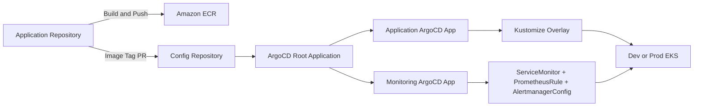
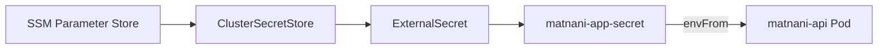

# 🥐 🥨 맛난이 프로젝트 Config 레포지토리

동네 기반 못난이 식품 거래 서비스 **맛난이(Matnani)** 의 Kubernetes 매니페스트와 ArgoCD GitOps 설정 저장소입니다.

공통 리소스는 Kustomize `base`에서 관리하고 Dev/Prod 차이는 `overlays`에서 패치합니다. ArgoCD는 환경별 App of Apps 구조로 애플리케이션과 모니터링 리소스를 지속적으로 동기화합니다.

<hr style="border: 2px solid #000;">

## 🔗 관련 레포지토리

| 레포지토리 | 설명 |
|-----------|------|
| [team3-matnani-app](https://github.com/CLD-05/team3-matnani-app) | 프론트엔드 + 백엔드 소스 코드 |
| [team3-matnani-config](https://github.com/CLD-05/team3-matnani-config) | Kubernetes 매니페스트 (ArgoCD GitOps) |
| [team3-matnani-infra](https://github.com/CLD-05/team3-matnani-infra) | AWS 인프라 (Terraform) |

<br>

<hr style="border: 2px solid #000;">

## 🔄 GitOps 흐름



<br>

<hr style="border: 2px solid #000;">

## 📐 설계 원칙

- 공통 Kubernetes 리소스는 `base`, 환경별 차이는 `overlays/dev`, `overlays/prod`에서 관리합니다.
- Dev와 Prod는 서로 다른 EKS 클러스터와 namespace에 배포합니다.
- ArgoCD의 `prune`과 `selfHeal`로 Git 상태를 클러스터의 기준 상태로 유지합니다.
- 애플리케이션 image tag는 각 환경 overlay에서만 변경합니다.
- 비밀값은 저장소에 기록하지 않고 SSM Parameter Store와 External Secrets Operator로 주입합니다.
- Terraform과 ArgoCD가 같은 Kubernetes 리소스를 동시에 관리하지 않도록 소유권을 분리합니다.
- HPA/KEDA가 조정하는 Deployment replicas는 ArgoCD가 되돌리지 않도록 차이를 무시합니다.

<br>

<hr style="border: 2px solid #000;">

## ⛏️ 기술 스택

| 영역 | 기술 |
| --- | --- |
| Container Orchestration | Amazon EKS, Kubernetes |
| GitOps | ArgoCD, App of Apps |
| Manifest Management | Kustomize Base/Overlay |
| Traffic | AWS Load Balancer Controller, ALB Ingress |
| Secret Delivery | External Secrets Operator, AWS SSM Parameter Store |
| Autoscaling | KEDA, HPA, Cluster Autoscaler |
| Monitoring | Prometheus Operator, ServiceMonitor, PrometheusRule, AlertmanagerConfig |

<br>

<hr style="border: 2px solid #000;">

## 📁 레포지토리 구조

```text
team3-matnani-config/
├── apps/team3-matnani/
│   ├── base/
│   │   ├── deployment.yaml         
│   │   ├── service.yaml            
│   │   ├── ingress.yaml            
│   │   ├── serviceaccount.yaml     
│   │   ├── keda-scaledobject.yaml  
│   │   └── kustomization.yaml
│   └── overlays/
│       ├── dev/                    
│       └── prod/                   
├── argocd/
│   ├── dev/
│   │   ├── root-app.yaml
│   │   ├── project.yaml
│   │   ├── application-dev.yaml
│   │   ├── application-monitoring.yaml
│   │   └── argocd-ingress.yaml
│   └── prod/
│       ├── root-app.yaml
│       ├── project.yaml
│       ├── application-prod.yaml
│       ├── application-monitoring.yaml
│       └── argocd-ingress.yaml
├── monitoring/
│   ├── base/                      
│   └── overlays/
│       ├── dev/                   
│       └── prod/                  
└── README.md
```

<br>
<hr style="border: 2px solid #000;">

## 🌿 환경 구성 (Dev / Prod)

| 항목 | Dev | Prod |
| --- | --- | --- |
| Namespace | `team3-matnani-dev` | `team3-matnani-prod` |
| Spring Profile | `dev` | `prod` |
| ECR Repository | `team3-matnani-dev-api` | `team3-matnani-prod-api` |
| Initial Replicas | Base 1 | Overlay 2, 이후 KEDA/HPA 관리 |
| Pod Resources | 250m/512Mi 요청 | 500m/1Gi 요청 |
| ALB | `team3-matnani-dev-alb` | `team3-matnani-prod-alb` |
| Secret Path | `/team3/matnani/dev/*` | `/team3/matnani/prod/*` |
| Monitoring Target | Dev API namespace | Prod API namespace |
| Slack Channel | Dev alerts | Prod alerts |


<br>
<hr style="border: 2px solid #000;">

## 📦 애플리케이션 매니페스트

### Deployment

- Spring Boot API는 `8080` 포트를 사용합니다.
- readiness probe는 `/actuator/health`로 트래픽 수신 가능 여부를 판단합니다.
- liveness probe는 같은 endpoint로 애플리케이션 복구 필요 여부를 판단합니다.
- `topologySpreadConstraints`와 `kubernetes.io/hostname`을 이용해 Pod를 노드별로 분산합니다.
- `ScheduleAnyway`를 사용해 분산 조건을 만족하지 못해도 Pod 배포 자체는 막지 않습니다.

### Autoscaling

KEDA ScaledObject가 API Deployment를 대상으로 CPU 사용률을 감시합니다.

```text
Target CPU: 70%
Min replicas: 1
Max replicas: 5
Cooldown: 300s
```

Prod ArgoCD Application은 Deployment의 `/spec/replicas`를 `ignoreDifferences`로 제외하고 `RespectIgnoreDifferences=true`를 사용합니다. 따라서 ArgoCD self-heal과 KEDA/HPA가 replicas 값을 두고 충돌하지 않습니다.

### Ingress

- AWS Load Balancer Controller가 Ingress를 감지해 internet-facing ALB를 관리합니다.
- Target type은 `ip`이며 Pod로 직접 라우팅합니다.
- `/actuator/health`를 ALB health check endpoint로 사용합니다.
- Dev/Prod overlay가 환경별 ALB 이름을 지정합니다.

<hr style="border: 2px solid #000;">

## 🔐 시크릿 흐름



`ClusterSecretStore`와 ESO Helm release는 Infra 저장소가 관리합니다. 이 저장소는 환경별 `ExternalSecret`과 Kubernetes Secret 매핑만 관리합니다.

애플리케이션이 사용하는 주요 Secret key는 다음과 같습니다.

```text
SPRING_DATASOURCE_URL
SPRING_DATASOURCE_USERNAME
SPRING_DATASOURCE_PASSWORD
JWT_SECRET
SPRING_DATA_REDIS_HOST
BUSINESS_API_KEY
CLOUD_AWS_S3_BUCKET
```

SSM parameter의 값은 Git이나 ArgoCD 화면에 기록하지 않습니다.

<br>

<hr style="border: 2px solid #000;">

## 🚀 ArgoCD App of Apps

Dev와 Prod는 각각 자신의 EKS 클러스터에서 별도 root application을 실행합니다.

```text
team3-matnani-root-{env}
├── team3-matnani-project
├── team3-matnani-app-{env}
├── team3-matnani-monitoring
└── argocd-ingress
```

클러스터 최초 구성 시 root application만 한 번 수동 적용합니다.

```bash
# Dev
kubectl --context matnani-dev apply -f argocd/dev/root-app.yaml

# Prod
kubectl --context matnani-prod apply -f argocd/prod/root-app.yaml
```

이후 `main` 변경은 ArgoCD가 자동 감지하며, 삭제된 리소스는 `prune`, 수동 변경은 `selfHeal`로 Git 상태에 맞춥니다.


<br>
<hr style="border: 2px solid #000;">

## 🖼️ 이미지 업데이트 흐름

백엔드 CI가 새 image를 ECR에 push한 뒤 환경 overlay의 `newTag`를 변경합니다.

```yaml
images:
  - name: team3-matnani-api
    newName: <environment-ecr-repository>
    newTag: "<git-sha>"
```

1. App Repository에서 Docker image를 빌드하고 ECR에 push합니다.
2. Config Repository의 환경별 `newTag` 변경 PR을 생성합니다.
3. PR을 검토하고 병합합니다.
4. ArgoCD가 변경을 감지해 Deployment rollout을 수행합니다.
5. Pod readiness와 image tag를 확인합니다.

Prod image 변경은 반드시 PR diff와 배포 대상 SHA를 검토한 후 병합합니다.

<hr style="border: 2px solid #000;">

## 📊 모니터링


### 소유권

| 소유자 | 관리 대상 |
| --- | --- |
| Infra Repository / Terraform | kube-prometheus-stack, ESO, Namespace, ClusterSecretStore, IRSA |
| Config Repository / ArgoCD | ExternalSecret, AlertmanagerConfig, ServiceMonitor, PrometheusRule |

동일한 `ExternalSecret` 또는 `AlertmanagerConfig`를 Terraform과 Config Repository 양쪽에 만들면 Slack 중복 알림과 ArgoCD drift가 발생합니다. 리소스를 이동할 때는 기존 Terraform state와 클러스터의 레거시 리소스까지 정리합니다.


### 애플리케이션 메트릭

ServiceMonitor는 환경별 API namespace의 `app=matnani-api` Service를 선택하고, 15초마다 `/actuator/prometheus`를 수집합니다.


### 알람 규칙

| Alert | 조건 | 대기 시간 |
| --- | --- | --- |
| `HighErrorRate` | 5xx 요청 비율 1% 초과 | 1분 |
| `HighLatency` | p99 응답시간 500ms 초과 | 2분 |
| `PodDown` | API scrape target down | 1분 |
| `HighMemoryUsage` | 컨테이너 메모리 85% 초과 | 5분 |

Alertmanager는 환경별 SSM Slack Webhook과 채널을 사용하며 firing/resolved 알림을 전송합니다.

<br>
<hr style="border: 2px solid #000;">

## 🌿 브랜치 전략

| 브랜치 | 설명 |
|--------|------|
| `main` | 프로덕션 배포 기준 브랜치. PR을 통해서만 병합 가능 |
| `feature/{이름}/{기능}` | 매니페스트 변경 브랜치 (예: `feature/yueun/argocd`) |
| `fix/{이름}/{기능}` | 버그 수정 브랜치 (예: `fix/yueun/argocd-fix`) |
| `ci/bump-{env}-{sha}` | CI가 자동 생성하는 image tag 업데이트 브랜치 |

<hr style="border: 2px solid #000;">

## ❕ 보안 주의사항

- Kubernetes Secret 원문, SSM 값, Slack Webhook, DB 비밀번호를 커밋하지 않습니다.
- `kubectl get secret -o yaml` 또는 base64 decode 결과를 문서와 CI 로그에 남기지 않습니다.
- Prod image tag, CORS origin, Ingress 변경은 리뷰 후 수동 병합합니다.